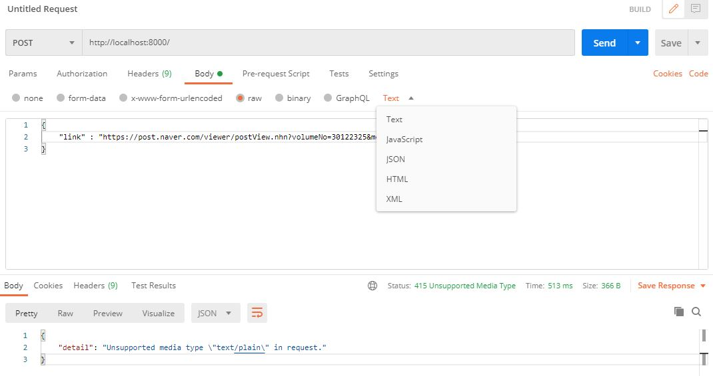

- DB모델링


```
# manage.py가 있는 위치에서
> python manage.py makemigrations
> python manage.py migrate
```


- serializer 파일 생성(json형태로 반환)

> models.py와 같은 위치에 serializers.py 파일 생성


- DRF 설정

```
> pip install django-rest-framework
```

- CORS 설정

```
> pip install django-cors-headers
```

> CORS에러는 내 로컬 서버에 외부에서 다른 도메인이 데이터를 요청할 때 허용하지 않아 생기는 오류임


- urls설정

> Project 하위 urls.py에 작성


> App 하위에 urls.py 생성


- views.py

> 기존주소를 DB에서 조회 후 없으면 변환해서 저장하기


> 기존 주소 변환하기


> 변환주소를 다시 기존주소로 redirect하기


- Postman 검증

```
"detail": "Unsupported media type \"text/plain\" in request."
```


이러한 오류가 발생했을 때, Text를 JSON으로 바꿔주면 된다.




## 설치 package 관리

- 해당 프로젝트를 받아서 바로 실행할 수 있게 모든 설치한 패키치들을 저장

```
$ pip freeze > requirements.txt
```

- pull받은 후 모든 패키치 한번에 설치하기(서버 돌리기 전)

```
$ pip install -r requirements.txt
```

