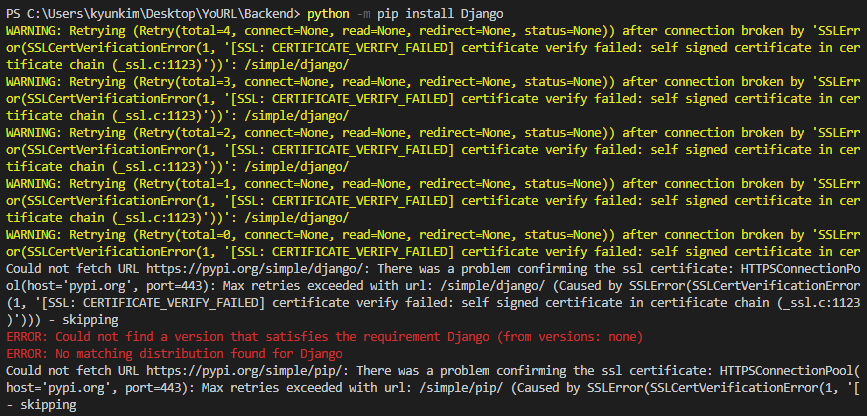

- Django 설치

```
> python -m pip install Django
```




해결방안참고

http://melonicedlatte.com/2020/08/12/082300.html 

```
> pip install --trusted-host pypi.python.org --trusted-host files.pythonhosted.org --trusted-host pypi.org {django}
```


- 프로젝트 생성

```
> django-admin startproject YoURL
```


- 실행확인

```
> python manage.py runserver
```


- 앱 생성

```
> cd {프로젝트이름}
```

```
> python manage.py startapp urls
```

